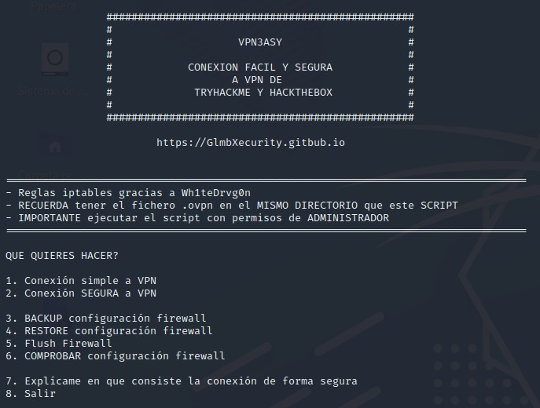
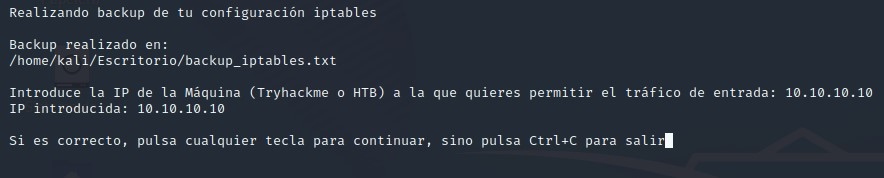
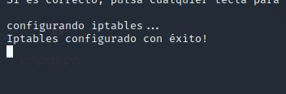
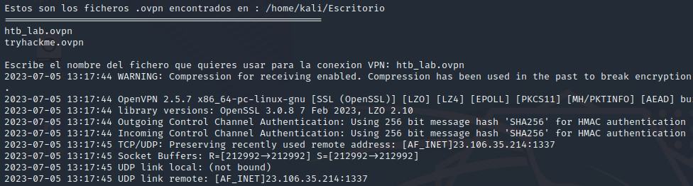

# Vpn3asy
Automatiza y securiza la conexión por VPN a las maquinas virtuales de Tryhackme y Hackthebox, auqnue sirve para securizar cualquier conexión, está orientado principalmente para eso.

## Funciones que incluye:
- 1- Conexión simple a VPN
- 2- Conexión segura a VPN
- 3- Backup de configuración iptables
- 4- Restore de configuración iptables
- 5- Flush iptables
- 6- Comprobar configuración iptables

## Modo de empleo
Muy sencillo,
- 1 - ubicamos el script donde queramos, y metemos en el mismo directorio el/los ficheros .ovpn que queramos utilizar para la conexion.
- 2 - Ejecutamos el script con **Permisos de administrador**
- 3 - A funcionar!

El hecho de ejecutar con permisos de administrador es que se requiere para realizar la conexión VPN, y también se requiere para realizar cambios en Iptables (Vital para la conexión segura)

##Capturas del script

